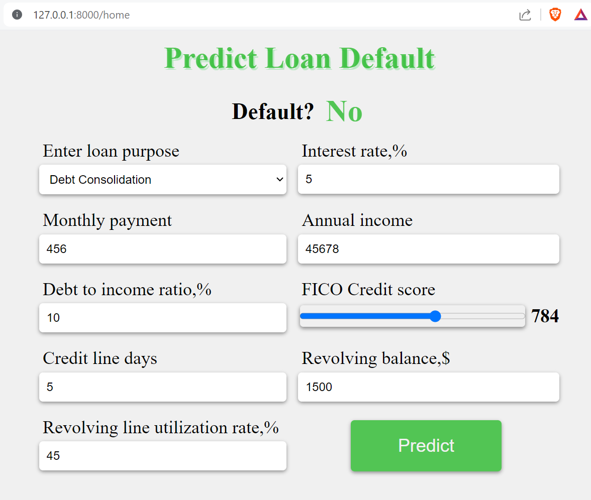

# A Loan Default Prediction WebApp

Visit at [Render](https://loan-app-0t4q.onrender.com)

This projects showcases how to serve a trained machine learning model
while creating a user interface for interaction with users. 
When a user enters their details, these details are saved to a database.
They can be used to re-train the model whenever required or serve as the
test set.

## Tools
This reactive UI is built with HTML, CSS and vanilla JavaScript
The backend runs on FastAPI which avails the frontend resources and the
machine learning model. The ML model is trained using ScikitLearn while
SQLModel is used to interact with PostgreSQL.

To run the project locally clone this repo and:
```
$cd app
```

Create a virtual environment
```
$python -m venv .venv #Linux python3
```

Activate the environment:
# On Linux
```
$source .venv/bin/activate
```
# On Windows
```
$.venv/Scripts/activate
```

To run the app:
```
$uvicorn main:app --reload
```

Navigate to ```http://127.0.0.1/8000/```

# Example
